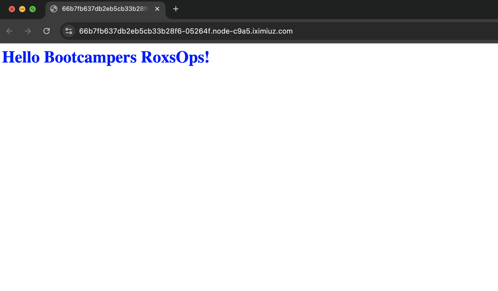

## Despliega una Aplicación Python con Flask

Aprenderás a desplegar una aplicación Flask en un servidor Ubuntu (o la distro de tu elección). Flask es un microframework de Python que permite crear aplicaciones web de manera sencilla. 


## Paso 1: Instalar los Componentes desde los Repositorios de Ubuntu

Primero, actualiza el índice de paquetes locales e instala los paquetes necesarios, incluyendo `pip`, el administrador de paquetes de Python, y otros paquetes de desarrollo:

```bash
sudo apt update
sudo apt install -y python3-pip python3-dev build-essential libssl-dev libffi-dev python3-setuptools
```

## Paso 2: Crear un Entorno Virtual de Python

Configura un entorno virtual para aislar tu aplicación Flask de los paquetes de Python del sistema:

1. **Instalar el paquete `python3-venv`**

   ```bash
   sudo apt install -y python3-venv
   ```

2. **Crear y activar el entorno virtual**

   ```bash
   mkdir ~/myproject
   cd ~/myproject
   python3 -m venv myprojectenv
   source myprojectenv/bin/activate
   ```

   Verás el prefijo `(myprojectenv)` en tu terminal, indicando que estás trabajando dentro del entorno virtual.

## Paso 3: Configurar la Aplicación Flask

1. **Instalar Flask**

   Asegúrate de que `wheel` esté instalado y luego instala Flask:

   ```bash
   pip install wheel
   pip install flask
   ```

2. **Crear una aplicación de ejemplo**

   Crea un archivo `myproject.py` con el siguiente contenido:

   ```python
   from flask import Flask
   app = Flask(__name__)

   @app.route("/")
   def hello():
       return "<h1 style='color:blue'>Hello Bootcampers RoxsOps!</h1>"

   if __name__ == "__main__":
       app.run(host='0.0.0.0')
   ```

   Guarda el archivo y cierra el editor.

3. **Probar la aplicación**

   Ejecuta la aplicación Flask:

   ```bash
   python myproject.py
   ```

   Abre tu navegador y visita `http://your_server_ip:5000 || http://localhost:5000` para ver la aplicación en acción. Deberías ver el mensaje "Hello Bootcampers RoxsOps!".



   Detén el servidor de desarrollo presionando `CTRL-C` en la terminal.

