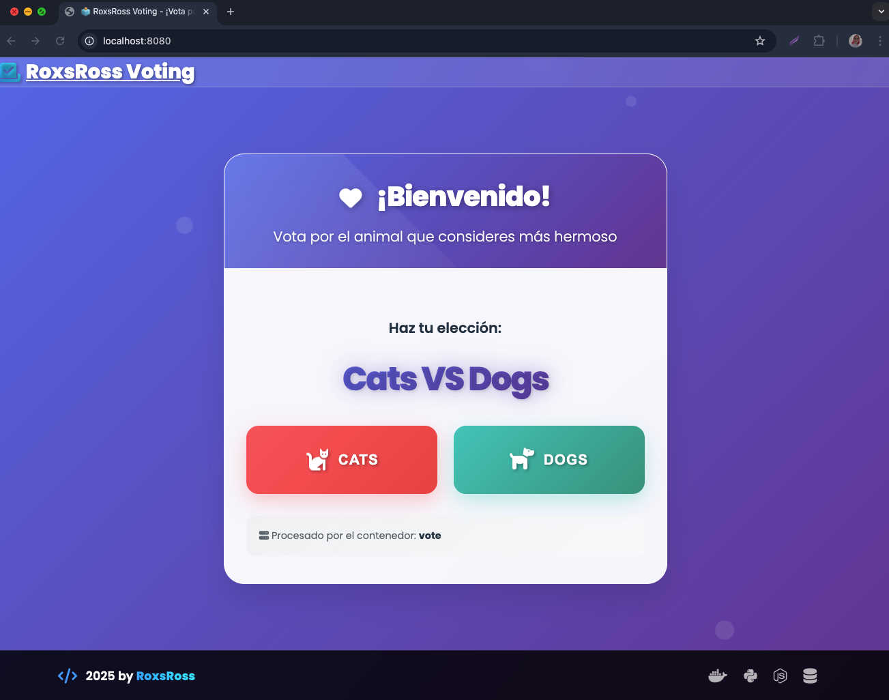
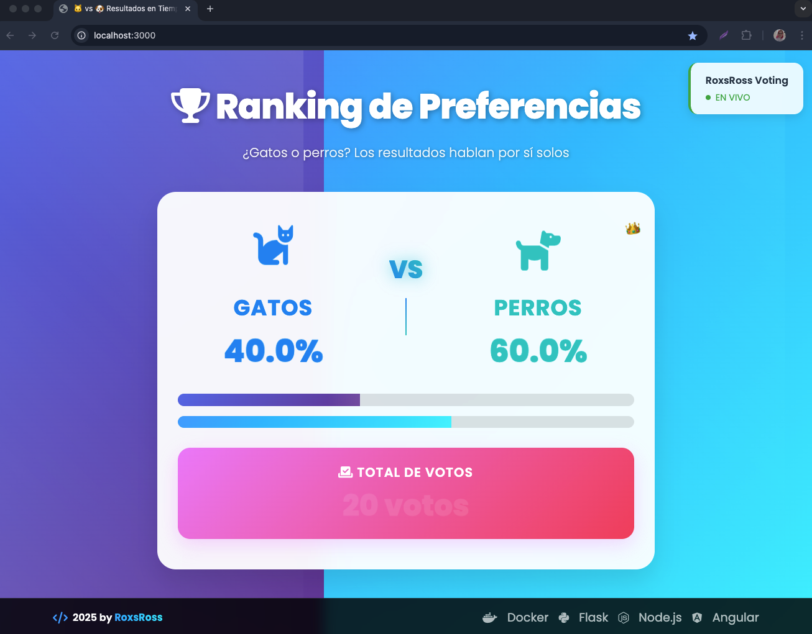

### 🧪 Ejecutá la App de Votación en tu Entorno Local


> Consolidá todo lo aprendido esta semana ejecutando una app real con múltiples componentes.

---

## 🎯 Objetivo

Poner en marcha **Roxs Voting App**, una aplicación de votación distribuida que te permitirá aplicar conceptos de Linux, scripting, automatización con Ansible y máquinas virtuales con Vagrant.




---

## 🛠️ ¿Qué vas a hacer?

* ✅ Clonar el repositorio del proyecto educativo
* ✅ Usar Vagrant para levantar el entorno
* ✅ Automatizar configuraciones básicas
* ✅ Ejecutar los tres servicios (Vote, Worker, Result)
* ✅ Validar que los datos fluyan desde la votación hasta la visualización

---

## 📦 Repositorio base

```bash
git clone https://github.com/roxsross/roxs-devops-project90.git
cd roxs-devops-project90
```

> Solo están disponibles los servicios. Vos vas a construir el resto.

---

## 🧩 Arquitectura

```
[ Vote (Flask) ] ---> Redis ---> [ Worker (Node.js) ] ---> PostgreSQL
                                       ↓
                               [ Result (Node.js) ]
```

Cada componente vive en su propia carpeta y puede ser iniciado de forma independiente.

---

## ✅ Requisitos

* Tener instalado:

  * Git
  * Vagrant
  * VirtualBox
  * Python 3.13+, Node.js 20+

---

## 🌐 Puertos de la Aplicación

Cada servicio expone un puerto distinto en tu máquina local:

| Servicio   | Descripción                                     | Puerto                  |
| ---------- | ----------------------------------------------- | ----------------------- |
| Vote       | Formulario de votación (Flask)                  | `80`                  |
| Result     | Resultados en tiempo real (Node.js + WebSocket) | `3000`                  |
| Redis      | Almacenamiento temporal de votos                | `6379`                  |
| Worker     | Proceso en segundo plano (Node.js)              | — (sin puerto expuesto) |
| PostgreSQL | Base de datos relacional para los resultados    | `5432`                  |

> 🧠 *Tip*: Podés acceder al formulario de votación en tu navegador con `http://localhost` y los resultados en `http://localhost:3000`.

--- 

## 🚀 Actividades

1. Usar un `Vagrantfile` para levantar una máquina Ubuntu local
2. Automatizar la instalación de Redis, PostgreSQL, Python y Node.js con Ansible
3. Ejecutar manualmente cada componente de la app
4. Validar que puedas votar y ver el resultado en el navegador

---

## 🎯 Resultado Esperado

* App funcional en entorno local
* Automatización básica de dependencias
* Experiencia práctica de orquestar servicios sin Docker (aún)

---

## 💡 Bonus

* Creá un script llamado `iniciar_app.sh` que levante todos los servicios
* Compartí screenshots en la comunidad con el hashtag **#DevOpsConRoxs**

---

## 🔗 Recursos útiles

* [Repositorio del Proyecto](https://github.com/roxsross/roxs-devops-project90)
* [Markdown para Documentación](https://www.markdownguide.org/)
* [DevOps Roadmap](https://roadmap.sh/devops)

---

🔥 ¡Felicitaciones! Completaste la primera semana del desafío. Prepará tus herramientas, porque la próxima... ¡Docker entra en escena!
